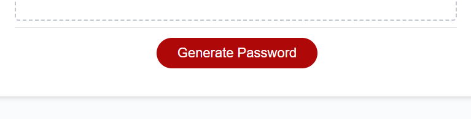
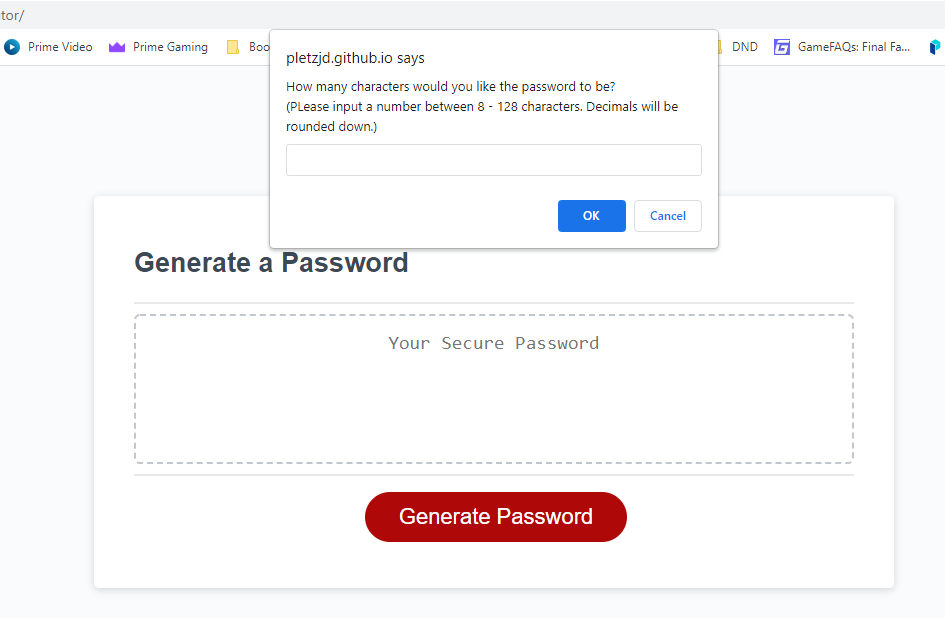
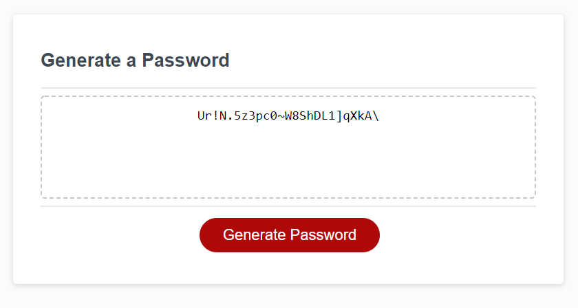

# Challenge-3-Password-Generator
## Description

The goal of this assignment was to write and javascript function to generate a random password based on inputs from the user:

- Password lenght (must be between 8-128 characters)
- Whether or not to include lowercase, uppercase, numbers or special characters

## Live Deployment link

The live deployment of the site can be found at: https://pletzjd.github.io/Challenge-3-Password-Generator/

## Usage

The main functionalities of the site are:

- 'Generate Password' button.

- Once the button is clicked the site will display a series of promts to get the parameters the user desires for their password

- Once the program runs the password will be displayed int the dashed box

## Credits

Password generator code developper(s):
- Jordan Pletzer: https://github.com/pletzjd

Initial code provided by:
- University of Toronto School of Continuing Studies: https://bootcamp.learn.utoronto.ca/coding/curriculum/

## License

MIT License

Copyright (c) [2022] [Jordan Daniel Joseph Pletzer]

Permission is hereby granted, free of charge, to any person obtaining a copy
of this software and associated documentation files (the "Software"), to deal
in the Software without restriction, including without limitation the rights
to use, copy, modify, merge, publish, distribute, sublicense, and/or sell
copies of the Software, and to permit persons to whom the Software is
furnished to do so, subject to the following conditions:

The above copyright notice and this permission notice shall be included in all
copies or substantial portions of the Software.

THE SOFTWARE IS PROVIDED "AS IS", WITHOUT WARRANTY OF ANY KIND, EXPRESS OR
IMPLIED, INCLUDING BUT NOT LIMITED TO THE WARRANTIES OF MERCHANTABILITY,
FITNESS FOR A PARTICULAR PURPOSE AND NONINFRINGEMENT. IN NO EVENT SHALL THE
AUTHORS OR COPYRIGHT HOLDERS BE LIABLE FOR ANY CLAIM, DAMAGES OR OTHER
LIABILITY, WHETHER IN AN ACTION OF CONTRACT, TORT OR OTHERWISE, ARISING FROM,
OUT OF OR IN CONNECTION WITH THE SOFTWARE OR THE USE OR OTHER DEALINGS IN THE
SOFTWARE.